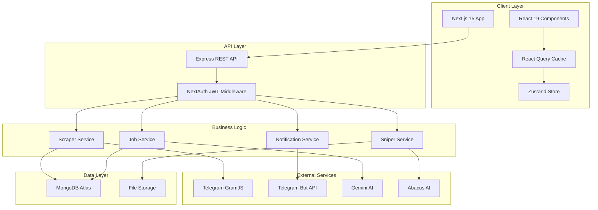

# JobSniper: Technical Deep-Dive

> Full-stack AI-powered job aggregation platform from Telegram channels

---

## 🎯 Project Overview

**JobSniper** automates job discovery and application by:

1. Monitoring curated Telegram channels in real-time
2. Parsing unstructured job posts with AI into structured data
3. Filtering jobs with advanced multi-dimensional search
4. Generating AI-tailored resumes for each position
5. Sending smart notifications for matching opportunities

**Timeline:** 8 days (November 29 - December 10, 2025)

---

## 🏗️ Architecture

### System Design



### Backend: 3-Layer Architecture

```
┌─────────────────────────────────────────┐
│         HTTP Layer (Controllers)        │
│  • Request validation (Joi schemas)     │
│  • JWT authentication check             │
│  • Format responses                     │
└─────────────────────────────────────────┘
                  ↓
┌─────────────────────────────────────────┐
│       Business Logic (Services)         │
│  • Orchestrate operations               │
│  • Call AI providers                    │
│  • Compose sub-services                 │
└─────────────────────────────────────────┘
                  ↓
┌─────────────────────────────────────────┐
│      Data Access (Repositories)         │
│  • MongoDB queries                      │
│  • Mongoose models                      │
│  • File system operations               │
└─────────────────────────────────────────┘
```

**Why this matters:**

- **Testable:** Each layer mocked independently
- **Maintainable:** Changes isolated to single layer
- **Scalable:** Services composable, repositories shared

---

## 🛠️ Tech Stack Deep-Dive

### Backend Stack

| **Component**       | **Technology**        | **Purpose**                                    |
| ------------------- | --------------------- | ---------------------------------------------- |
| **Runtime**         | Node.js 18+           | Async/await, event-driven architecture         |
| **Framework**       | Express.js 4          | Lightweight REST API framework                 |
| **Language**        | TypeScript 5.3        | Type safety, interfaces, path aliases          |
| **Database**        | MongoDB Atlas         | Flexible schema for unstructured job data      |
| **ODM**             | Mongoose 8            | Schema validation, middleware hooks            |
| **Telegram Client** | GramJS 2.26           | Official Telegram library for message scraping |
| **Telegram Bot**    | node-telegram-bot-api | Bot API for notifications                      |
| **AI Provider 1**   | Gemini API (Google)   | Job parsing, resume tailoring                  |
| **AI Provider 2**   | Abacus.ai             | Alternative AI provider with fallback          |
| **Authentication**  | JWT + bcrypt          | Stateless auth, secure password hashing        |
| **Validation**      | Joi 17                | Schema-based request validation                |
| **File Processing** | multer, pdf-parse     | Resume upload \u0026 text extraction           |
| **PDF Generation**  | pdfkit                | Custom PDF creation                            |
| **DOCX Generation** | docx 8                | Word document generation                       |
| **Web Scraping**    | cheerio               | External job page parsing                      |

### Frontend Stack

| **Component**      | **Technology**        | **Purpose**                                  |
| ------------------ | --------------------- | -------------------------------------------- |
| **Framework**      | Next.js 15            | React framework with App Router              |
| **UI Library**     | React 19              | Latest React with concurrent features        |
| **Language**       | TypeScript 5.7        | Strict type safety                           |
| **Styling**        | Tailwind CSS 4        | Utility-first CSS, OKLCH color space         |
| **State (Server)** | React Query 5         | Server state caching, mutations              |
| **State (Client)** | Zustand 5             | Lightweight client state                     |
| **HTTP Client**    | Axios 1.7             | Promise-based requests with interceptors     |
| **Component UI**   | shadcn/ui (Radix UI)  | Accessible, customizable components          |
| **Icons**          | Lucide React (1,500+) | Consistent icon system                       |
| **Animations**     | Framer Motion 12      | Smooth UI transitions                        |
| **Forms**          | React Hook Form + Zod | Performant validation                        |
| **Notifications**  | Sonner                | Toast notifications                          |
| **Search**         | Fuse.js               | Fuzzy search for channels                    |
| **Auth**           | NextAuth.js 4         | Multi-provider OAuth (Google, Yandex, Email) |
| **Database**       | MongoDB (via Adapter) | User persistence                             |

---

## 🔌 Key Integrations

### 1. Telegram Integration (Dual Approach)

#### **GramJS (Scraping)**

**Purpose:** Real-time message listening from Telegram channels

**Implementation:**

```typescript
// telegram.service.ts
import { TelegramClient } from 'telegram';

class TelegramService {
  async startListening() {
    // Auto-join recommended channels
    await this.joinChannels(recommendedChannels);

    // Listen for new messages
    this.client.addEventHandler(async (event) => {
      const message = event.message;
      // Parse with AI
      const parsedJob = await jobService.parseJob(message.text);
      // Save to MongoDB
      await jobRepository.create(parsedJob);
    }, new NewMessage({}));
  }
}
```

**Features:**

- Persistent session via `TELEGRAM_SESSION_STRING`
- Graceful reconnection on network failures
- Optional disable flag (`DISABLE_SCRAPER=true`) for production

#### **Bot API (Notifications)**

**Purpose:** Send job alerts to users via Telegram bot

**Implementation:**

```typescript
// telegram-bot.service.ts
import TelegramBot from 'node-telegram-bot-api';

class TelegramBotService {
  async sendJobNotification(chatId: string, job: Job) {
    await this.bot.sendMessage(chatId, formatJobMessage(job), {
      parse_mode: 'Markdown',
      reply_markup: {
        inline_keyboard: [
          [
            { text: '🔗 View Job', url: job.link },
            { text: '📄 Tailor Resume', callback_data: `tailor_${job.id}` },
          ],
        ],
      },
    });
  }
}
```

**Features:**

- Webhook support for production (Render/Railway)
- `/start` command with subscription token
- Inline keyboard for quick actions

### 2. AI Provider Integration (Dual Providers)

#### **Gemini AI (Primary)**

**Use Cases:**

- Job post parsing (unstructured → structured)
- Resume tailoring (custom summaries, skills, cover letters)

**Implementation:**

```typescript
// ai/gemini.provider.ts
import { GoogleGenerativeAI } from '@google/genai';

export async function parseJob(text: string): Promise\u003cParsedJob\u003e {
  const prompt = `
    Parse this job posting into JSON:
    ${text}

    Extract: jobTitle, company, techStack[], salary, level, locationType, experienceYears, description
  `;

  const result = await genai.generateContent(prompt);
  return JSON.parse(result.response.text());
}
```

#### **Abacus.ai (Fallback)**

**Purpose:** Alternative AI provider if Gemini fails or rate-limited

**Configuration:**

```typescript
// env.config.ts
const AI_PROVIDER = process.env.AI_PROVIDER || 'gemini'; // 'gemini' | 'abacus'
```

### 3. MongoDB Atlas Integration

**Schema Design:**

```typescript
// User Schema
{
  email: string (unique, indexed)
  subscribedChannels: string[] (indexed)
  notificationFilters: {
    stack: string[]
    level: string[]
    locationType: string[]
  }
  telegramChatId: string (indexed, sparse)
  viewedJobs: string[] (indexed)
  subscriptionChanges: {
    count: number
    lastResetDate: Date
  }
}

// Job Schema
{
  channelId: ObjectId (indexed)
  messageId: number
  rawText: string
  parsedData: {
    jobTitle: string (indexed)
    company: string
    techStack: string[] (indexed)
    level: string (indexed)
    locationType: string (indexed)
    experienceYears: { min: number, max: number }
  }
  createdAt: Date (TTL index: 7 days)
}
```

**Optimizations:**

- Compound indexes on `[techStack, level, locationType]` for filters
- TTL index on `createdAt` for auto-cleanup
- Projection queries (select only needed fields)

### 4. NextAuth Multi-Provider Authentication

**Providers:**

1. **Google OAuth** - Sign in with Google
2. **Yandex OAuth** - Custom provider for Yandex users
3. **Email Magic Links** - Passwordless via MailerSend SMTP

**Session Strategy:**

- **Type:** JWT (stateless)
- **Storage:** HTTP-only secure cookies
- **Adapter:** MongoDB for user persistence
- **Callbacks:** Custom JWT callback for user metadata

**Implementation:**

```typescript
// auth.ts
export const authOptions: NextAuthOptions = {
  providers: [
    GoogleProvider({ clientId, clientSecret }),
    YandexProvider({ clientId, clientSecret }),
    EmailProvider({ server: smtp, from: email }),
  ],
  adapter: MongoDBAdapter(clientPromise),
  session: { strategy: 'jwt' },
  callbacks: {
    async jwt({ token, user }) {
      if (user) token.userId = user.id;
      return token;
    },
  },
};
```

---

## 🚀 Feature Breakdown

### 1. Advanced Job Filtering System

**Multi-Dimensional Filters:**

- **Tech Stack:** Multi-select autocomplete with fuzzy search
- **Experience Level:** Junior/Mid/Senior checkboxes
- **Location Type:** Remote/Hybrid/Onsite radios
- **Job Function:** Frontend/Backend/Full Stack/DevOps/etc.
- **Years of Experience:** Min/max slider (0-20+)
- **Exclusions:** Mute keywords, excluded job titles

**Backend Implementation:**

```typescript
// job.repository.ts
async searchJobs(filters: JobFilters) {
  const query: any = {};

  if (filters.stack?.length) {
    query['parsedData.techStack'] = { $in: filters.stack };
  }

  if (filters.level?.length) {
    query['parsedData.level'] = { $in: filters.level };
  }

  if (filters.experienceYears) {
    query['parsedData.experienceYears.min'] = { $lte: filters.experienceYears.max };
    query['parsedData.experienceYears.max'] = { $gte: filters.experienceYears.min };
  }

  return await Job.find(query)
    .skip(filters.offset)
    .limit(filters.limit)
    .sort({ createdAt: -1 });
}
```

**Frontend Implementation:**

```typescript
// use-jobs.ts
export function useJobs(filters: JobFilters) {
  return useQuery({
    queryKey: ['jobs', filters],
    queryFn: () => jobsApi.searchJobs(filters),
    staleTime: 5 * 60 * 1000, // 5 minutes
  });
}
```

### 2. AI Resume Tailoring ("Sniper")

**Flow:**

1. User uploads master resume (PDF/DOCX)
2. Resume text extracted with `pdf-parse` or `mammoth`
3. User clicks "Tailor Resume" on a job
4. AI analyzes job requirements vs. resume
5. Generates:
   - Custom resume summary
   - Tailored skills section
   - Cover letter
   - Telegram application message
6. Exports to PDF and DOCX

**Service Composition:**

```typescript
// sniper.service.ts
export class SniperService {
  constructor(
    private aiTailorService: AiTailorService,
    private pdfGenerator: PdfGeneratorService,
    private docxGenerator: DocxGeneratorService
  ) {}

  async generateTailoredResume(userId: string, jobId: string) {
    // 1. Get resume and job
    const user = await userRepo.findById(userId);
    const job = await jobRepo.findById(jobId);

    // 2. AI tailoring
    const tailored = await this.aiTailorService.tailor(
      user.masterResumeText,
      job.parsedData
    );

    // 3. Generate files
    const pdfPath = await this.pdfGenerator.generate(tailored);
    const docxPath = await this.docxGenerator.generate(tailored);

    return { pdfPath, docxPath, ...tailored };
  }
}
```

### 3. Smart Notification System

**Features:**

- **Custom Filters:** Match user's saved filter preferences
- **Quiet Hours:** Timezone-aware silence periods
- **Deduplication:** Never send duplicate notifications
- **Subscription Management:** Unique token-based signup via Telegram bot

**Notification Flow:**

```typescript
// notification.service.ts
async notifyMatchingUsers(job: Job) {
  // Find users with matching filters
  const users = await this.findMatchingUsers(job);

  for (const user of users) {
    // Check quiet hours
    if (this.isQuietHour(user.quietHours)) continue;

    // Check if already notified
    if (await this.hasNotified(user.id, job.id)) continue;

    // Send notification
    await telegramBot.sendJobNotification(user.telegramChatId, job);

    // Track notification
    await this.markNotified(user.id, job.id);
  }
}
```

### 4. Channel Bundle Onboarding

**Problem:** First-time users don't know which channels to subscribe to.

**Solution:** Curated bundles (e.g., "Tech Jobs", "Remote Work", "Senior Roles")

**Implementation:**

```typescript
// Backend: bundle.seed.ts
const bundles = [
  {
    name: "Tech Starter Pack",
    channels: ["remotedev", "itjobs", "devremote"],
    category: "Technology",
    order: 1
  },
  {
    name: "Senior Engineer Focus",
    channels: ["seniorjobs", "leaddev"],
    category: "Experience Level",
    order: 2
  }
];

// Frontend: channel-onboarding-modal.tsx
const { data: bundles } = useBundles();

\u003cBundleGrid\u003e
  {bundles.map(bundle =\u003e (
    \u003cBundleCard
      bundle={bundle}
      onSelect={() =\u003e subscribeToBundle(bundle.channels)}
    /\u003e
  ))}
\u003c/BundleGrid\u003e
```

### 5. Infinite Scroll Job Feed

**Optimization:**

- 20 jobs per page
- Intersection Observer API for auto-loading
- React Query cache (5-min stale time, 30-min GC)
- Skeleton loading states

**Implementation:**

```typescript
// use-infinite-jobs.ts
export function useInfiniteJobs(filters: JobFilters) {
  return useInfiniteQuery({
    queryKey: ['jobs-infinite', filters],
    queryFn: ({ pageParam = 0 }) =\u003e
      jobsApi.searchJobs({ ...filters, offset: pageParam }),
    getNextPageParam: (lastPage, pages) =\u003e
      lastPage.hasMore ? pages.length * 20 : undefined,
    staleTime: 5 * 60 * 1000
  });
}

// Component
const { data, fetchNextPage, hasNextPage, isFetching } = useInfiniteJobs(filters);
const { ref } = useIntersectionObserver({
  onIntersect: fetchNextPage,
  enabled: hasNextPage \u0026\u0026 !isFetching
});

return (
  \u003c\u003e
    {data.pages.map(page =\u003e page.jobs.map(job =\u003e \u003cJobCard job={job} /\u003e))}
    \u003cdiv ref={ref}\u003e{isFetching \u0026\u0026 \u003cSkeleton /\u003e}\u003c/div\u003e
  \u003c/\u003e
);
```

---

## 🔐 Security Implementation

### 1. Authentication \u0026 Authorization

```typescript
// auth.middleware.ts
export const authenticateJWT = async (req, res, next) =\u003e {
  const token = req.headers.authorization?.split(' ')[1];

  if (!token) throw new UnauthorizedError('No token provided');

  try {
    const payload = jwt.verify(token, JWT_SECRET);
    req.userId = payload.userId;
    next();
  } catch (err) {
    throw new UnauthorizedError('Invalid token');
  }
};
```

### 2. Input Validation

```typescript
// validation.middleware.ts
import Joi from 'joi';

const jobSearchSchema = Joi.object({
  stack: Joi.array().items(Joi.string()),
  level: Joi.array().items(Joi.string().valid('Junior', 'Mid', 'Senior')),
  limit: Joi.number().min(1).max(100),
  offset: Joi.number().min(0),
});

export const validateJobSearch = validate(jobSearchSchema);
```

### 3. File Upload Security

```typescript
// resume.controller.ts
import multer from 'multer';

const upload = multer({
  storage: multer.diskStorage({...}),
  limits: { fileSize: 10 * 1024 * 1024 }, // 10MB
  fileFilter: (req, file, cb) =\u003e {
    if (!['application/pdf', 'application/vnd.openxmlformats-officedocument.wordprocessingml.document'].includes(file.mimetype)) {
      return cb(new BadRequestError('Only PDF and DOCX allowed'));
    }
    cb(null, true);
  }
});
```

### 4. Error Handling

```typescript
// error.middleware.ts
export const errorHandler = (err, req, res, next) =\u003e {
  if (err instanceof AppError) {
    // Operational error (user mistake)
    return res.status(err.statusCode).json({
      success: false,
      message: err.message
    });
  }

  // Programmer error (bug)
  logger.error(err.stack);
  res.status(500).json({
    success: false,
    message: NODE_ENV === 'production' ? 'Internal server error' : err.message
  });
};
```

---

## 📊 Performance Optimizations

### Backend

1. **MongoDB Indexes:**

   - `email` (unique, users)
   - `techStack` (multi-key, jobs)
   - `createdAt` (TTL, jobs)
   - `telegramChatId` (sparse, users)

2. **Query Optimization:**

   - Projection (select only needed fields)
   - Pagination (limit/skip)
   - Lean queries (skip Mongoose hydration)

3. **Caching:**
   - In-memory cache for channel list (1 hour)
   - Redis potential for high-traffic

### Frontend

1. **React Query:**

   - 5-minute stale time for jobs
   - Background refetching
   - Optimistic updates for mutations

2. **Code Splitting:**

   - Dynamic imports for heavy components
   - Next.js automatic chunking

3. **Image Optimization:**
   - Next.js Image component (lazy load, WebP)

---

## 🧪 Testing Strategy

### Unit Tests (Planned)

```typescript
// job.service.test.ts
describe('JobService', () =\u003e {
  it('should parse job posting with AI', async () =\u003e {
    const mockAI = jest.fn().mockResolvedValue({...});
    const service = new JobService(mockAI);

    const result = await service.parseJob('React Developer needed');

    expect(result.parsedData.techStack).toContain('React');
  });
});
```

### Integration Tests (Planned)

```typescript
// jobs.routes.test.ts
describe('POST /api/jobs/search', () =\u003e {
  it('should return filtered jobs', async () =\u003e {
    const response = await request(app)
      .post('/api/jobs/search')
      .set('Authorization', `Bearer ${token}`)
      .send({ stack: ['React'] });

    expect(response.status).toBe(200);
    expect(response.body.data.jobs).toBeInstanceOf(Array);
  });
});
```

---

## 🚀 Deployment

### Backend: Render / Railway

**Environment Variables:**

- `MONGODB_URI` - MongoDB Atlas connection
- `JWT_SECRET` - JWT signing key
- `GEMINI_API_KEY` - AI provider
- `TELEGRAM_BOT_TOKEN` - Bot API
- `DISABLE_SCRAPER=true` - Production flag

**Build Command:** `npm run build`

**Start Command:** `npm start`

### Frontend: Vercel

**Environment Variables:**

- `NEXT_PUBLIC_API_URL` - Backend URL
- `NEXTAUTH_URL` - Frontend URL
- `NEXTAUTH_SECRET` - NextAuth secret
- `MONGODB_URI` - Database
- `GOOGLE_CLIENT_ID` - OAuth
- `GOOGLE_CLIENT_SECRET` - OAuth

**Framework:** Next.js (auto-detected)

---

## 📈 Metrics \u0026 Impact

| **Metric**                | **Value**              |
| ------------------------- | ---------------------- |
| **Development Time**      | 8 days                 |
| **LOC (Estimated)**       | ~15,000+               |
| **API Endpoints**         | 30+                    |
| **Backend Modules**       | 11                     |
| **Service Layers**        | 13                     |
| **Frontend Components**   | 50+                    |
| **README Documentation**  | 1,543 lines            |
| **Tech Stack Items**      | 40+                    |
| **AI Models Utilized**    | 2 (Gemini, Abacus)     |
| **External Integrations** | 4 (Telegram x2, AI x2) |

---

## 🎓 Key Takeaways

### Technical Skills Demonstrated

✅ **Full-Stack Development** - Node.js/Express backend, Next.js/React frontend
✅ **TypeScript Mastery** - Strict types, interfaces, path aliases
✅ **Database Design** - MongoDB schema optimization, indexing
✅ **API Design** - RESTful conventions, request validation
✅ **Authentication** - JWT, OAuth, multi-provider
✅ **AI Integration** - Prompt engineering, dual-provider fallback
✅ **Real-Time Systems** - Telegram message listening, webhooks
✅ **State Management** - React Query (server), Zustand (client)
✅ **Security** - Input validation, file upload restrictions, error sanitization
✅ **Documentation** - Comprehensive READMEs with examples

### Soft Skills Demonstrated

✅ **Project Planning** - Breaking complex system into modules
✅ **AI Collaboration** - Strategic delegation to AI agents
✅ **Code Quality** - Clean architecture, type safety
✅ **Product Thinking** - User flows, onboarding, free tier limits
✅ **Time Management** - Production-ready in 8 days

---

**This is not an MVP. This is production-grade software.**
